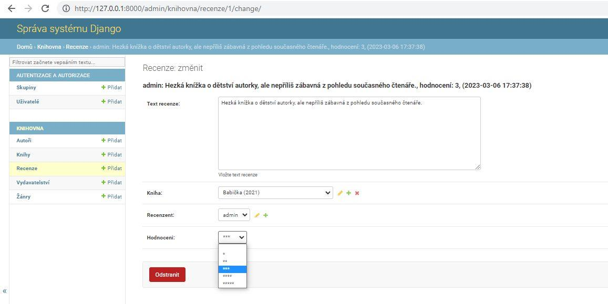
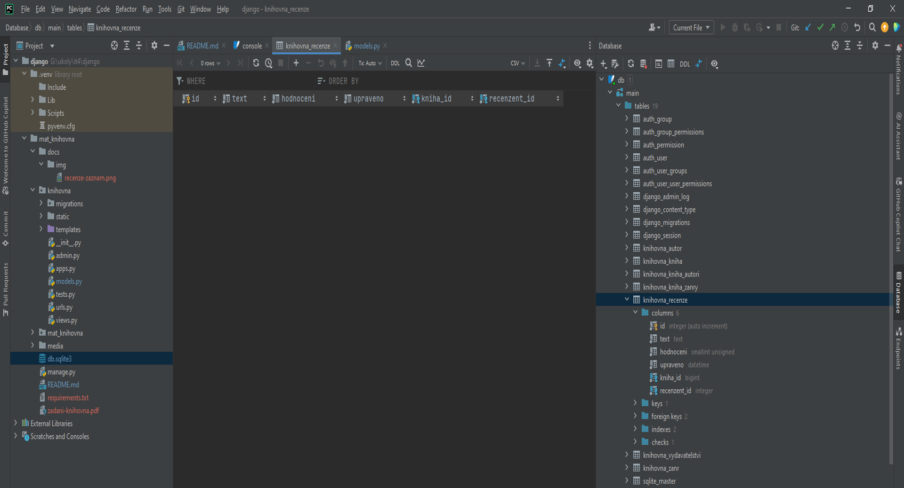
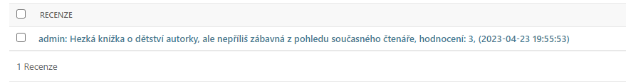

# Django - Školní knihovna

## Školní příklad

### Instalace

1. Klonování repozitáře

- `git clone https://github.com/lucny/django_knihovna.git`

2. Přesun do adresáře webu

- `python -m venv .venv`

3. Vytvoření virtuálního prostředí do složky .venv

- `python -m venv .venv`

4. Aktivace virtuálního prostředí

- `.venv\Scripts\activate` (aktivace virtuálního prostředí - ve Windows)
- `.venv/bin/activate` (aktivace virtuálního prostředí - v Linuxu)

5. Instalace závislostí

- `pip install -r requirements.txt`

6. Spuštění aplikace

- `python manage.py runserver`

### Přístupové údaje do administrace

- superuživatel: `admin`
- heslo: `admin`

---

## Řešení praktických úloh

### 1. Vytvoření nového modelu Rezervace

**Zadání:**

- V souboru `models.py` vytvořte nový model **Recenze**, který umožní *oprávněným uživatelům* přidávat do
  aplikace recenze vybrané knihy (obě pole - `recenzent` a `kniha` - budou provázána s už existujícími modely
  vztahy 1:N).
- Součástí recenze bude *povinné* textové pole `text` (bude sloužit k zapsání textu recenze) a
  *povinný* výběrový seznam `hodnoceni` (umožňuje zadat hodnocení v rozsahu *0 až 5*, přičemž do databáze se
  uloží číselná hodnota a v seznamu uživatel uvidí řetězec tvořený příslušným *počtem hvězdiček*; výchozí
  hodnota bude nastavena na *3*).
- Součástí modelu bude také pole `upraveno`, jehož prostřednictvím bude v databázi automaticky uloženo datum,
  kdy byla recenze naposledy *aktualizována*.
- Nezapomeňte v modelu nastavit vhodná pojmenování *popisků jednotlivých polí*, připojit stručné *návodné
  texty* pro zadávající uživatele a možná *chybová hlášení*.

**Příloha:**



**Řešení:**

V souboru `models.py` vytvořte nový model `Recenze`:

```python
# Import třídy User z balíčku django.contrib.auth.models
from django.contrib.auth.models import User

...


# Vytvoření modelu Recenze
class Recenze(models.Model):
    text = models.TextField(verbose_name='Text recenze', help_text='Vložte text recenze')
    kniha = models.ForeignKey(Kniha, on_delete=models.RESTRICT, verbose_name='Kniha')
    recenzent = models.ForeignKey(User, on_delete=models.CASCADE, verbose_name='Recenzent')
    HODNOCENI_KNIHY = (
        (0, ''),
        (1, '*'),
        (2, '**'),
        (3, '***'),
        (4, '****'),
        (5, '*****'),
    )
    hodnoceni = models.PositiveSmallIntegerField(verbose_name='Hodnocení', default=3, choices=HODNOCENI_KNIHY)
    upraveno = models.DateTimeField(auto_now=True)
```

**Poznámky k řešení:**

Třída `Recenze` dědí od třídy `models.Model`, která je součástí balíčku `django.db.models`. Tento balíček obsahuje
třídy a funkce, které umožňují definovat strukturu databáze.

Podrobnější informace o tvorbě modelů naleznete v oficiální dokumentaci Django:

- [Django - Modely](https://docs.djangoproject.com/en/5.0/topics/db/models/)

Modelové třídy obsahují atributy, které reprezentují jednotlivé sloupce v databázové tabulce.
Pro každý sloupec je definován typ pole a další parametry, které ovlivňují jeho chování.

Podrobnější informace o jednotlivých typech polí naleznete v oficiální dokumentaci Django:

- [Django - Pole modelů](https://docs.djangoproject.com/en/5.0/topics/db/models/#fields)
  Podrobnější informace o jednotlivých parametrech polí naleznete v oficiální dokumentaci Django:
- [Django - Parametry polí](https://docs.djangoproject.com/en/5.0/ref/models/fields/#field-options)

Součástí modelu `Recenze` jsou následující pole:

- Pole `text` je typu `TextField` (
  viz [Django - TextField](https://docs.djangoproject.com/en/5.0/ref/models/fields/#textfield)),
  který umožňuje ukládat textové řetězce libovolné délky.
    - Parametr `verbose_name` (
      viz [Django - verbose_name](https://docs.djangoproject.com/en/5.0/ref/models/fields/#verbose-name))
      slouží k definici popisku sloupce v administraci.
    - Parametr `help_text` (viz [Django - help_text](https://docs.djangoproject.com/en/5.0/ref/models/fields/#help-text)
      slouží k definici návodného textu pro zadávající uživatele.
- Pole `kniha` je cizím klíčem na model `Kniha` (
  viz [Django - ForeignKey](https://docs.djangoproject.com/en/5.0/ref/models/fields/#foreignkey)),
  který umožňuje provázat recenzi s konkrétní knihou.
    - Parametr `on_delete` (
      viz [Django - on_delete](https://docs.djangoproject.com/en/5.0/ref/models/fields/#django.db.models.ForeignKey.on_delete))
      určuje chování databáze při smazání propojeného záznamu. Konkrétně nastavení `models.RESTRICT` znamená, že v
      případě pokusu o smazání knihy bude smazání zablokováno, protože na ni existuje odkaz v tabulce recenzí.
    - Parametr `verbose_name` slouží k definici popisku sloupce v administraci.
- Pole `recenzent` je cizím klíčem na model `User`, který umožňuje provázat recenzi s konkrétním uživatelem.
  Model `User` je součástí balíčku `django.contrib.auth.models` (ten je třeba správně importovat) a obsahuje informace o
  uživatelích aplikace (
  viz [Django - User](https://docs.djangoproject.com/en/5.0/ref/contrib/auth/#django.contrib.auth.models.User)).
    - Parametr `on_delete` určuje chování databáze při smazání propojeného záznamu. Konkrétně nastavení `models.CASCADE`
      znamená, že v případě smazání uživatele budou smazány i všechny jeho recenze.
    - Parametr `verbose_name` slouží k definici popisku sloupce v administraci.
- Pole `hodnoceni` je typu `PositiveSmallIntegerField` (je určeno pro ukládání celých čísel v rozsahu 0 až 32767).
    - Kromě základního parametru `verbose_name` je definován parametr `choices` (
      viz [Django - choices](https://docs.djangoproject.com/en/5.0/ref/models/fields/#choices)), který umožňuje výběr z
      předem definovaných hodnot připravených v konstantě `HODNOCENI_KNIHY`. Každá hodnota seznamu (list) je dvojice (
      n-tice) obsahující číselnou hodnotu a textový popis.
    - Výchozí hodnota je atributem `default` nastavena na 3.
- Pole `upraveno` je typu `DateTimeField` (
  viz [Django - DateTimeField](https://docs.djangoproject.com/en/5.0/ref/models/fields/#datetimefield)),
  který umožňuje ukládat datum a čas poslední úpravy záznamu.
    - Parametr `auto_now` (
      viz [Django - auto_now](https://docs.djangoproject.com/en/5.0/ref/models/fields/#django.db.models.DateField))
      je nastaven na `True`, což znamená, že se do tohoto pole automaticky uloží aktuální datum a čas při každé
      aktualizaci záznamu.

Aby se model `Recenze` objevil také v databázi, je třeba provést migraci, která vytvoří odpovídající tabulku.
Migraci provedeme pomocí příkazů `python manage.py makemigrations` a `python manage.py migrate`.
Výsledek migrace můžeme zkontrolovat v PyCharmu v záložce `Database`:



---

### 2. Úprava modelu Rezervace a jeho registrace v administraci

**Zadání:**

- V modelu bude nastaveno `výchozí řazení` podle hodnoty pole `hodnoceni` (*sestupně*).
- *Textová reprezentace* objektu bude odpovídat tomuto vzoru:



- Proveďte *migraci modelu* a jeho *registraci v administrační části*.
- Vložte do databáze testovací záznam podle vzoru:


**Řešení:**

1. V modelu `Recenze` upravte třídu `Recenze` následovně:

```python
class Recenze(models.Model):
    ...

    # Vnitřní třída Meta s dalšími metainformacemi o modelu
    class Meta:
        ordering = ['-hodnoceni']
        verbose_name = 'Recenze'
        verbose_name_plural = 'Recenze'

    # Metoda pro textovou reprezentaci objektu
    def __str__(self):
        return (f'{self.recenzent.last_name if self.recenzent.last_name else self.recenzent}: {self.text}, '
                f'hodnocení: {self.hodnoceni}, ({self.upraveno.strftime("%Y-%m-%d %H:%M:%S")})')
```

2. Proveďte migraci modelu pomocí příkazů `python manage.py makemigrations` a `python manage.py migrate`.
3. V souboru `admin.py` v adresáři aplikace a zaregistrujte model `Recenze`:

```python
from django.contrib import admin
# Import modelu Recenze
from .models import Autor, Kniha, Vydavatelstvi, Zanr, Recenze

...
# Registrace modelu Recenze
admin.site.register(Recenze)
```

4. Spusťte vývojový server a na adrese `http://localhost:8000/admin` se přihlaste jako superuživatel (admin/admin).
5. V sekci `Recenze` vložte testovací záznam podle vzoru.

**Poznámky k řešení:**

- Vnitřní třída `Meta` obsahuje další metainformace o modelu, např. `ordering` určuje výchozí řazení záznamů.
  V tomto případě jsou záznamy řazeny sestupně podle hodnoty pole `hodnoceni`. Atributy `verbose_name`
  a `verbose_name_plural` slouží k definici popisku modelu v administraci. Podrobnější informace o možnostech použití
  třídy `Meta` naleznete [Django - Meta options](https://docs.djangoproject.com/en/5.0/ref/models/options/).
- Metoda `__str__` (
  viz [Django - Model instance reference](https://docs.djangoproject.com/en/5.0/ref/models/instances/#str))
  definuje textovou reprezentaci objektu. V tomto případě se zobrazí jméno recenzenta (pokud je
  vyplněno), text recenze, hodnocení a datum poslední úpravy.
  Klíčové slovo `self` odkazuje na aktuální instanci objektu. Díky tomu můžeme přistupovat k jednotlivým atributům
  objektu a vytvářet textovou reprezentaci podle požadovaného formátu.

> [!TIP]
> V Pythonu lze formátovat řetězce pomocí metody `str.format()` nebo f-stringů (od verze Python 3.6) - viz
> [Python - Formátování řetězců](https://realpython.com/python-f-strings/).
> - F-stringy umožňují vkládat do řetězců proměnné a výrazy pomocí závorek `{}`.
> - V příkladu je použit f-string pro vytvoření textové reprezentace objektu `Recenze`.
> - Součástí je i tzv. *ternární operátor* (podmíněný výraz), který umožňuje zkrácený zápis podmínky typu `if-else`. Zde
    konkrétně slouží k zobrazení příjmení recenzenta, pokud je vyplněno, jinak se zobrazí uživatelské jméno.
> - Metoda `strftime()` (
    viz [Python - Metoda strftime()](https://www.w3schools.com/python/gloss_python_date_strftime.asp))
    slouží k formátování data a času podle zadaného formátu. V tomto případě se zobrazí datum a čas poslední úpravy ve
    formátu `YYYY-MM-DD HH:MM:SS`.

- Registace modelu `Recenze` v administraci se provádí pomocí funkce `admin.site.register(Recenze)`.
  Tímto krokem se model `Recenze` zaregistruje v administraci a bude možné spravovat záznamy v sekci `Recenze`. Bez této
  registrace by nebylo možné zobrazit a editovat záznamy v administraci.