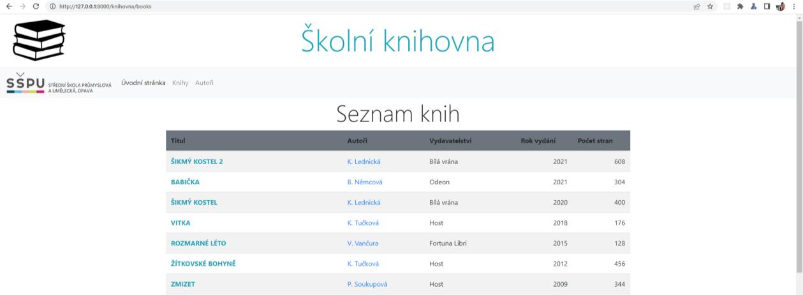
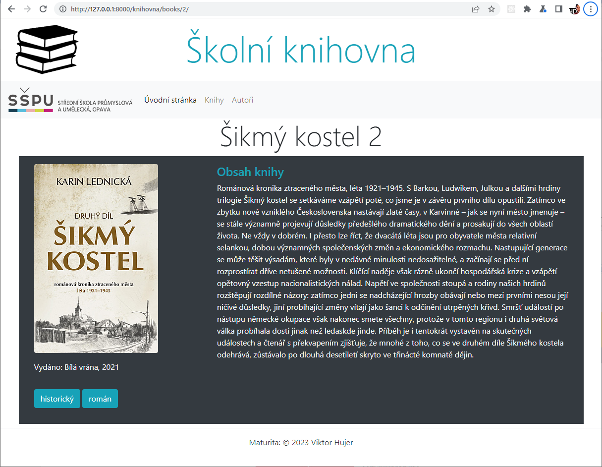
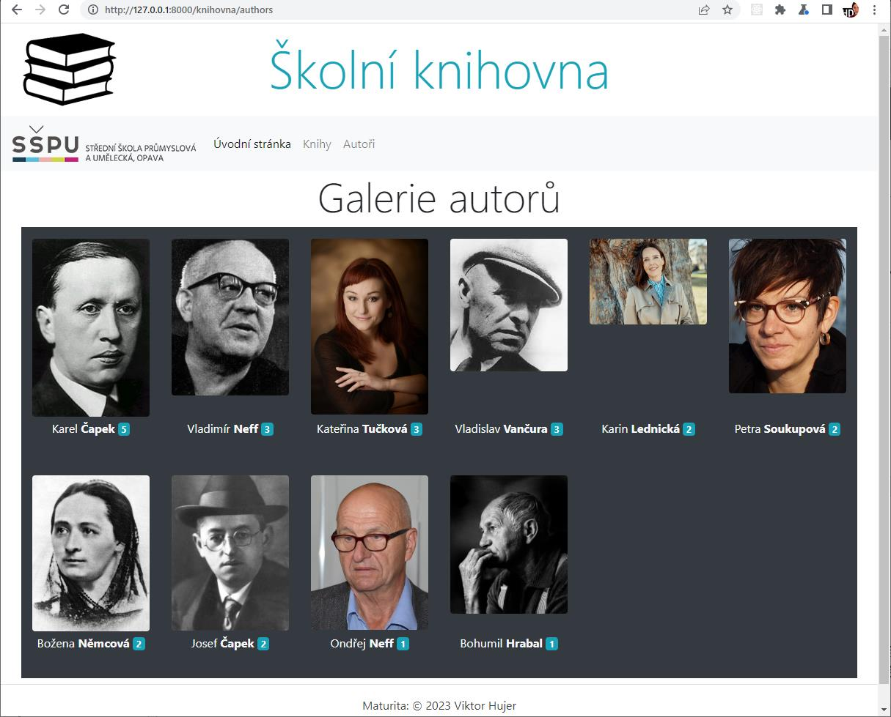
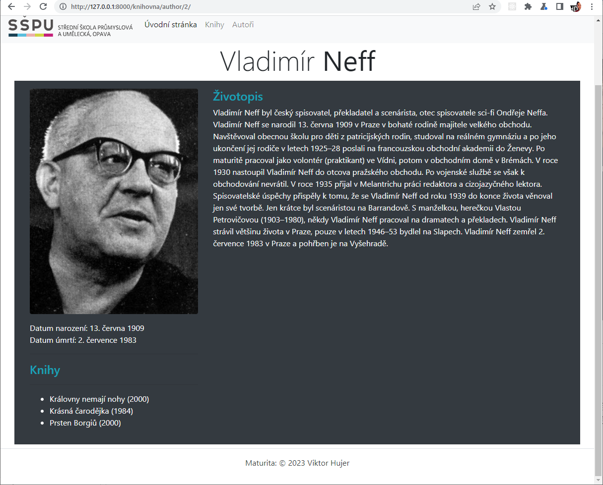

# Django - Školní knihovna

## Školní příklad

### Instalace

1. Klonování repozitáře

- `git clone https://github.com/lucny/django_knihovna.git`

2. Přesun do adresáře webu

- `python -m venv .venv`

3. Vytvoření virtuálního prostředí do složky .venv

- `python -m venv .venv`

4. Aktivace virtuálního prostředí

- `.venv\Scripts\activate` (aktivace virtuálního prostředí - ve Windows)
- `.venv/bin/activate` (aktivace virtuálního prostředí - v Linuxu)

5. Instalace závislostí

- `pip install -r requirements.txt`

6. Spuštění aplikace

- `python manage.py runserver`

### Přístupové údaje do administrace

- superuživatel: `admin`
- heslo: `admin`

---

## Řešení praktických úloh

### 1. Vytvoření nového modelu Rezervace

**Zadání:**

- V souboru `models.py` vytvořte nový model **Recenze**, který umožní *oprávněným uživatelům* přidávat do
  aplikace recenze vybrané knihy (obě pole - `recenzent` a `kniha` - budou provázána s už existujícími modely
  vztahy 1:N).
- Součástí recenze bude *povinné* textové pole `text` (bude sloužit k zapsání textu recenze) a
  *povinný* výběrový seznam `hodnoceni` (umožňuje zadat hodnocení v rozsahu *0 až 5*, přičemž do databáze se
  uloží číselná hodnota a v seznamu uživatel uvidí řetězec tvořený příslušným *počtem hvězdiček*; výchozí
  hodnota bude nastavena na *3*).
- Součástí modelu bude také pole `upraveno`, jehož prostřednictvím bude v databázi automaticky uloženo datum,
  kdy byla recenze naposledy *aktualizována*.
- Nezapomeňte v modelu nastavit vhodná pojmenování *popisků jednotlivých polí*, připojit stručné *návodné
  texty* pro zadávající uživatele a možná *chybová hlášení*.

**Příloha:**


**Řešení:**

V souboru `models.py` vytvořte nový model `Recenze`:

```python
# Import třídy User z balíčku django.contrib.auth.models
from django.contrib.auth.models import User

...


# Vytvoření modelu Recenze
class Recenze(models.Model):
    text = models.TextField(verbose_name='Text recenze', help_text='Vložte text recenze')
    kniha = models.ForeignKey(Kniha, on_delete=models.RESTRICT, verbose_name='Kniha')
    recenzent = models.ForeignKey(User, on_delete=models.CASCADE, verbose_name='Recenzent')
    HODNOCENI_KNIHY = (
        (0, ''),
        (1, '*'),
        (2, '**'),
        (3, '***'),
        (4, '****'),
        (5, '*****'),
    )
    hodnoceni = models.PositiveSmallIntegerField(verbose_name='Hodnocení', default=3, choices=HODNOCENI_KNIHY)
    upraveno = models.DateTimeField(auto_now=True)
```

**Poznámky k řešení:**

Třída `Recenze` dědí od třídy `models.Model`, která je součástí balíčku `django.db.models`. Tento balíček obsahuje
třídy a funkce, které umožňují definovat strukturu databáze.

Podrobnější informace o tvorbě modelů naleznete v oficiální dokumentaci Django:

- [Django - Modely](https://docs.djangoproject.com/en/5.0/topics/db/models/)

Modelové třídy obsahují atributy, které reprezentují jednotlivé sloupce v databázové tabulce.
Pro každý sloupec je definován typ pole a další parametry, které ovlivňují jeho chování.

Podrobnější informace o jednotlivých typech polí naleznete v oficiální dokumentaci Django:

- [Django - Pole modelů](https://docs.djangoproject.com/en/5.0/topics/db/models/#fields)

Podrobnější informace o jednotlivých parametrech polí naleznete v oficiální dokumentaci Django:

- [Django - Parametry polí](https://docs.djangoproject.com/en/5.0/ref/models/fields/#field-options)

Součástí modelu `Recenze` jsou následující pole:

- Pole `text` je typu `TextField` (
  viz [Django - TextField](https://docs.djangoproject.com/en/5.0/ref/models/fields/#textfield)),
  který umožňuje ukládat textové řetězce libovolné délky.
    - Parametr `verbose_name` (
      viz [Django - verbose_name](https://docs.djangoproject.com/en/5.0/ref/models/fields/#verbose-name))
      slouží k definici popisku sloupce v administraci.
    - Parametr `help_text` (viz [Django - help_text](https://docs.djangoproject.com/en/5.0/ref/models/fields/#help-text)
      slouží k definici návodného textu pro zadávající uživatele.
- Pole `kniha` je cizím klíčem na model `Kniha` (
  viz [Django - ForeignKey](https://docs.djangoproject.com/en/5.0/ref/models/fields/#foreignkey)),
  který umožňuje provázat recenzi s konkrétní knihou.
    - Parametr `on_delete` (
      viz [Django - on_delete](https://docs.djangoproject.com/en/5.0/ref/models/fields/#django.db.models.ForeignKey.on_delete))
      určuje chování databáze při smazání propojeného záznamu. Konkrétně nastavení `models.RESTRICT` znamená, že v
      případě pokusu o smazání knihy bude smazání zablokováno, protože na ni existuje odkaz v tabulce recenzí.
    - Parametr `verbose_name` slouží k definici popisku sloupce v administraci.
- Pole `recenzent` je cizím klíčem na model `User`, který umožňuje provázat recenzi s konkrétním uživatelem.
  Model `User` je součástí balíčku `django.contrib.auth.models` (ten je třeba správně importovat) a obsahuje informace o
  uživatelích aplikace (
  viz [Django - User](https://docs.djangoproject.com/en/5.0/ref/contrib/auth/#django.contrib.auth.models.User)).
    - Parametr `on_delete` určuje chování databáze při smazání propojeného záznamu. Konkrétně nastavení `models.CASCADE`
      znamená, že v případě smazání uživatele budou smazány i všechny jeho recenze.
    - Parametr `verbose_name` slouží k definici popisku sloupce v administraci.
- Pole `hodnoceni` je typu `PositiveSmallIntegerField` (je určeno pro ukládání celých čísel v rozsahu 0 až 32767).
    - Kromě základního parametru `verbose_name` je definován parametr `choices` (
      viz [Django - choices](https://docs.djangoproject.com/en/5.0/ref/models/fields/#choices)), který umožňuje výběr z
      předem definovaných hodnot připravených v konstantě `HODNOCENI_KNIHY`. Každá hodnota seznamu (list) je dvojice (
      n-tice) obsahující číselnou hodnotu a textový popis.
    - Výchozí hodnota je atributem `default` nastavena na 3.
- Pole `upraveno` je typu `DateTimeField` (
  viz [Django - DateTimeField](https://docs.djangoproject.com/en/5.0/ref/models/fields/#datetimefield)),
  který umožňuje ukládat datum a čas poslední úpravy záznamu.
    - Parametr `auto_now` (
      viz [Django - auto_now](https://docs.djangoproject.com/en/5.0/ref/models/fields/#django.db.models.DateField))
      je nastaven na `True`, což znamená, že se do tohoto pole automaticky uloží aktuální datum a čas při každé
      aktualizaci záznamu.

Aby se model `Recenze` objevil také v databázi, je třeba provést migraci, která vytvoří odpovídající tabulku.
Migraci provedeme pomocí příkazů `python manage.py makemigrations` a `python manage.py migrate`.
Výsledek migrace můžeme zkontrolovat v PyCharmu v záložce `Database`:


---

### 2. Úprava modelu Rezervace a jeho registrace v administraci

**Zadání:**

- V modelu bude nastaveno `výchozí řazení` podle hodnoty pole `hodnoceni` (*sestupně*).
- *Textová reprezentace* objektu bude odpovídat tomuto vzoru:


- Proveďte *migraci modelu* a jeho *registraci v administrační části*.
- Vložte do databáze testovací záznam podle vzoru:


**Řešení:**

1. V modelu `Recenze` upravte třídu `Recenze` následovně:

```python
class Recenze(models.Model):
    ...

    # Vnitřní třída Meta s dalšími metainformacemi o modelu
    class Meta:
        ordering = ['-hodnoceni']
        verbose_name = 'Recenze'
        verbose_name_plural = 'Recenze'

    # Metoda pro textovou reprezentaci objektu
    def __str__(self):
        return (f'{self.recenzent.last_name if self.recenzent.last_name else self.recenzent}: {self.text}, '
                f'hodnocení: {self.hodnoceni}, ({self.upraveno.strftime("%Y-%m-%d %H:%M:%S")})')
```

2. Proveďte migraci modelu pomocí příkazů `python manage.py makemigrations` a `python manage.py migrate`.
3. V souboru `admin.py` v adresáři aplikace a zaregistrujte model `Recenze`:

```python
from django.contrib import admin
# Import modelu Recenze
from .models import Autor, Kniha, Vydavatelstvi, Zanr, Recenze

...
# Registrace modelu Recenze
admin.site.register(Recenze)
```

4. Spusťte vývojový server a na adrese `http://localhost:8000/admin` se přihlaste jako superuživatel (admin/admin).
5. V sekci `Recenze` vložte testovací záznam podle vzoru.

**Poznámky k řešení:**

- Vnitřní třída `Meta` obsahuje další metainformace o modelu, např. `ordering` určuje výchozí řazení záznamů.
  V tomto případě jsou záznamy řazeny sestupně podle hodnoty pole `hodnoceni`. Atributy `verbose_name`
  a `verbose_name_plural` slouží k definici popisku modelu v administraci. Podrobnější informace o možnostech použití
  třídy `Meta` naleznete [Django - Meta options](https://docs.djangoproject.com/en/5.0/ref/models/options/).
- Metoda `__str__` (
  viz [Django - Model instance reference](https://docs.djangoproject.com/en/5.0/ref/models/instances/#str))
  definuje textovou reprezentaci objektu. V tomto případě se zobrazí jméno recenzenta (pokud je
  vyplněno), text recenze, hodnocení a datum poslední úpravy.
  Klíčové slovo `self` odkazuje na aktuální instanci objektu. Díky tomu můžeme přistupovat k jednotlivým atributům
  objektu a vytvářet textovou reprezentaci podle požadovaného formátu.

> [!TIP]
> V Pythonu lze formátovat řetězce pomocí metody `str.format()` nebo f-stringů (od verze Python 3.6) - viz
> [Python - Formátování řetězců](https://realpython.com/python-f-strings/).
> - F-stringy umožňují vkládat do řetězců proměnné a výrazy pomocí závorek `{}`.
> - V příkladu je použit f-string pro vytvoření textové reprezentace objektu `Recenze`.
> - Součástí je i tzv. *ternární operátor* (podmíněný výraz), který umožňuje zkrácený zápis podmínky typu `if-else`. Zde
    konkrétně slouží k zobrazení příjmení recenzenta, pokud je vyplněno, jinak se zobrazí uživatelské jméno.
> - Metoda `strftime()` (
    viz [Python - Metoda strftime()](https://www.w3schools.com/python/gloss_python_date_strftime.asp))
    slouží k formátování data a času podle zadaného formátu. V tomto případě se zobrazí datum a čas poslední úpravy ve
    formátu `YYYY-MM-DD HH:MM:SS`.

- Registace modelu `Recenze` v administraci se provádí pomocí funkce `admin.site.register(Recenze)`.
  Tímto krokem se model `Recenze` zaregistruje v administraci a bude možné spravovat záznamy v sekci `Recenze`. Bez této
  registrace by nebylo možné zobrazit a editovat záznamy v administraci.

---

### 3. Webová stránka Seznam knih

**Zadání:**

- Vytvořte v aplikaci novou webovou stránku, která bude na adrese `http://127.0.0.1:8000/knihovna/books`
  vypisovat v přehledné tabulce **Seznam knih** podle následujícího vzoru:



- Seznam bude uspořádán podle **roku vydání** (*sestupně*).
- Sloupec `Titul` bude obsahovat názvy knih s odkazy na stránky s detailem knihy.
- Sloupec `Autoři` bude obsahovat zkrácená jména všech autorů dané knihy a odkazovat na stránky s podrobnými údaji o
  autorovi.

**Řešení:**

1. Vytvořte nový pohled `SeznamKnihView` v souboru `views.py`:

```python   
from django.views.generic import ListView
from .models import Kniha

...


# Přidání třídy BooksListView, která dědí z generické třídy ListView
# Pohled zobrazuje seznam knih
class BooksListView(ListView):
    model = Kniha
    template_name = 'books/books_list.html'
    context_object_name = 'books'
    ordering = ['-rok_vydani']
```

> [!NOTE]
> **Poznámky k řešení:**
>
>- Pohled `BooksListView` dědí od třídy `ListView` (
   viz [Django - ListView](https://docs.djangoproject.com/en/5.0/ref/class-based-views/generic-display/#listview)).
   Tato třída umožňuje zobrazit seznam objektů z databáze v přehledné tabulce.
>- Atribut `model` určuje, který model bude použit pro získání dat. V tomto případě se jedná o model `Kniha`.
>- Atribut `template_name` určuje název šablony, která bude použita pro zobrazení dat. V tomto případě se jedná o
   šablonu
   `books_list.html` v adresáři `templates/books`.
>- Atribut `context_object_name` určuje název proměnné, která bude předána do šablony. V tomto případě se jedná o
   proměnnou
   `books`, která bude obsahovat seznam knih.
>- Atribut `ordering` určuje výchozí řazení záznamů. V tomto případě jsou záznamy řazeny sestupně podle roku vydání.

> [!TIP]
> Alternativně lze vytvořit pohled pomocí funkce `render()` a předat do šablony seznam knih pomocí slovníku.
> Příkladem je následující kód:
> ```python
> from django.shortcuts import render
> from .models import Kniha
> ...
> def books_list(request):
>  context = {
>      'books': Kniha.objects.order_by('-rok_vydani')
> }
> return render(request, 'books/books_list.html', context)
> ```
> V tomto případě se vytvoří slovník `context` s klíčem `books`, který obsahuje seznam knih seřazený sestupně podle roku
> vydání. Tento slovník se předá do šablony `books_list.html` pomocí funkce `render()`.
>
> Podrobnější informace o funkcích `render()` a `order_by()` naleznete v oficiální dokumentaci Django:
> - [Django - Funkce render()](https://docs.djangoproject.com/en/5.0/topics/http/shortcuts/#render)
> - [Django - Metoda order_by()](https://docs.djangoproject.com/en/5.0/ref/models/querysets/#order-by)
> - [Django - QuerySet API reference](https://docs.djangoproject.com/en/5.0/ref/models/querysets/)

> [!IMPORTANT]
> Soubor `views.py` v adresáři aplikace `knihovna` obsahuje definice pohledů, které zpracovávají požadavky uživatele.
> Úkolem pohledů je získat data z databáze, zpracovat je a předat je do šablony pro zobrazení.
>
> Pohledy v Django mohou být definovány jako funkce nebo třídy. V případě třídních pohledů je třeba pohled předat jako
> třídu pomocí metody `as_view()`. Třídní pohledy umožňují snadnější organizaci kódu a využití dědičnosti.
>
> Podrobnější informace o pohledech naleznete v oficiální dokumentaci Django:
> - [Django - Pohledy](https://docs.djangoproject.com/en/5.0/topics/http/views/)
> - [Django - Pohledy založené na třídách](https://docs.djangoproject.com/en/5.0/topics/class-based-views/)

2. Vytvořte šablonu `books_list.html` v adresáři `templates/books`:

```html


Seznam knih


<h2 class="display-4 text-center">Seznam knih</h2>
<div class="row mb-2">
    <div class="col-12">
        <table class="table table-responsive-lg table-striped table-hover">
            <thead class="bg-secondary">
            <tr>
                <th>Titul</th>
                <th>Autoři</th>
                <th>Vydavatelství</th>
                <th>Rok vydání</th>
                <th>Počet stran</th>
            </tr>
            </thead>
            <tbody>
            
            <tr>
                <td><strong><a href="#" class="text-info">{{ book.titul.upper }}</a></strong></td>
                <td>
                    
                    <a href="#">{{ autor.jmeno|first }}. {{ autor.prijmeni }}</a>
                    , 
                    
                </td>
                <td>{{ book.vydavatelstvi }}</td>
                <td class="text-right">{{ book.rok_vydani }}</td>
                <td class="text-right">{{ book.pocet_stran }}</td>
            </tr>
            
            </tbody>
        </table>
    </div>
</div>

```            

> [!NOTE]
> **Poznámky k řešení:**
>
>- Šablona `books_list.html` obsahuje bloky `title` a `content`, které rozšiřují základní šablonu `base.html`.
>- V bloku `content` je nadpis `Seznam knih` a tabulka s jednotlivými sloupci pro zobrazení informací o knihách.
>- V cyklu `` jsou postupně zpracovávány jednotlivé knihy z proměnné `books`.
>- V každém řádku tabulky jsou zobrazeny informace o titulu, autorech, vydavatelství, roce vydání a počtu stran.
>- Titul knihy je zobrazen jako tučný text s odkazem na stránku s detailem knihy. Pro zobrazení velkých písmen je
   použita
   metoda `upper` (
   viz [Django - Upper template filter](https://docs.djangoproject.com/en/5.0/ref/templates/builtins/#upper)).
>- Autoři knihy jsou zobrazeni jako odkazy na stránky s podrobnými údaji o autorovi. Pro zobrazení zkráceného jména
   autora
   je použit filtr `first` (
   viz [Django - First template filter](https://docs.djangoproject.com/en/5.0/ref/templates/builtins/#first)).
>- V cyklu `` jsou postupně zpracováváni všichni autoři dané knihy. V případě, že
   autor není poslední v seznamu, je za jménem zobrazena čárka.
>- V šabloně je použit Bootstrap (
   viz [Bootstrap - Oficiální stránky](https://getbootstrap.com/)) pro vytvoření responzivního designu tabulky.

> [!IMPORTANT]
> Šablony v Django jsou HTML soubory, které slouží k vizuálnímu zobrazení dat získaných z databáze nebo jiných zdrojů.
> Šablony mohou obsahovat HTML kód, CSS styly, JavaScript a speciální šablonovací značky (tagy) a filtry.
>
> Šablonovací značky a filtry umožňují dynamické zpracování dat a vytváření interaktivních webových stránek.
> Django používá vlastní šablonovací systém, který je inspirován jazykem šablon Jinja2.
>
> Podrobnější informace o šablonovacím systému Django naleznete v oficiální dokumentaci Django:
> - [Django - Šablony](https://docs.djangoproject.com/en/5.0/topics/templates/)
> - [Django - Šablony - Filtry](https://docs.djangoproject.com/en/5.0/topics/templates/#filters)
> - [Django - Šablony - Tagy](https://docs.djangoproject.com/en/5.0/topics/templates/#tags)
> - [Django - Šablony - Proměnné](https://docs.djangoproject.com/en/5.0/topics/templates/#variables)

3. Vytvořte novou URL adresu pro zobrazení seznamu knih v souboru `urls.py` v adresáři aplikace:

```python
from django.urls import path
from .views import SeznamKnihView

urlpatterns = [
    ...
    # URL adresa pro zobrazení seznamu knih
    path('books/', BooksListView.as_view(), name='books_list'),
]
``` 

> [!NOTE]
> **Poznámky k řešení:**
>
> - URL adresa `/books/` bude zobrazovat seznam knih pomocí pohledu `BooksListView`.
> - Pohled `BooksListView` je zde předán jako třída pomocí metody `as_view()`.
> - Název URL adresy je definován jako `books_list` a může být použit pro generování odkazů v šablonách.
> - Podrobnější informace o definici URL adres naleznete v oficiální dokumentaci Django:
    > [Django - URL dispatcher](https://docs.djangoproject.com/en/5.0/topics/http/urls/)

> [!IMPORTANT]
> Soubor `urls.py` v adresáři aplikace `knihovna` obsahuje definice URL adres pro jednotlivé části aplikace.
> Je součástí tzv. *systému URL dispatcher*, který zajišťuje směrování požadavků na jednotlivé části aplikace.
> Každá URL adresa je propojena s konkrétním pohledem, který zpracovává požadavky na danou adresu.
> Pohledy mohou být definovány jako funkce nebo třídy a zpracovávají požadavky uživatele, případně zobrazují data z
> databáze.
> V případě použití třídových pohledů je třeba pohled předat jako třídu pomocí metody `as_view()`.

---

### 4. Webová stránka Detail knihy

**Zadání:**

- Vytvořte v aplikaci novou webovou stránku, která bude na adrese `http://127.0.0.1:8000/books/<id knihy>`
  vypisovat podrobnosti o knize podle následujícího vzoru:



- Stránka bude v nadpisu obsahovat název knihy a pod ním budou responzivně zobrazeny bloky s obrázkem obálky,
  informace o vydavatelství, roce vydání, žánrech a obsahu knihy.

**Řešení:**

1. Vytvořte nový pohled `BookDetailView` v souboru `views.py`:

```python   
from django.views.generic import DetailView
from .models import Kniha

...


# Přidání třídy BookDetailView, která dědí z generické třídy DetailView
# Pohled zobrazuje detail knihy
class BookDetailView(DetailView):
    model = Kniha
    template_name = 'books/book_detail.html'
    context_object_name = 'book'
```

> [!NOTE]
> **Poznámky k řešení:**
>
> - Pohled `BookDetailView` dědí od třídy `DetailView` (
    viz [Django - DetailView](https://docs.djangoproject.com/en/5.0/ref/class-based-views/generic-display/#detailview)).
    Tato třída umožňuje zobrazit detailní informace o jednom objektu z databáze.
> - Atribut `model` určuje, který model bude použit pro získání dat. V tomto případě se jedná o model `Kniha`.
> - Atribut `template_name` určuje název šablony, která bude použita pro zobrazení dat. V tomto případě se jedná o
    šablonu
    `book_detail.html` v adresáři `templates/books`.
> - Atribut `context_object_name` určuje název proměnné, která bude předána do šablony. V tomto případě se jedná o
    proměnnou
    `book`, která bude obsahovat detailní informace o knize.

> [!TIP]
> Alternativně lze vytvořit pohled pomocí funkce `render()` a předat do šablony detail knihy pomocí slovníku.
> Příkladem je následující kód:
> ```python
> from django.shortcuts import render
> from .models import Kniha
> ...
> def book_detail(request, pk):
> book = Kniha.objects.get(pk=pk)
> context = {
>    'book': book
> }
> return render(request, 'books/book_detail.html', context)
> ```
> V tomto případě se vytvoří slovník `context` s klíčem `book`, který obsahuje detailní informace o knize. Tento slovník
> se předá do šablony `book_detail.html` pomocí funkce `render()`.

2. Vytvořte šablonu `book_detail.html` v adresáři `templates/books`:

```html


Detail knihy: {{ book.titul }}


<h2 class="display-4 text-center">{{ book.titul }}</h2>
<div class="row bg-dark p-3 mb-2">
    <div class="col-md-4 text-light">
        
        
        
        <p class="mt-3">Vydáno: {{ book.vydavatelstvi }}, {{ book.rok_vydani }}</p>
        <hr>
        <p>
            
            <a href="#" class="btn btn-info">{{ zanr }}</a>
            
        </p>
    </div>
    <div class="col-md-8">
        <h4 class="text-info">Obsah knihy</h4>
        <p class="text-light">{{ book.obsah }}</p>
    </div>
</div>

```

> [!NOTE]
> **Poznámky k řešení:**
>
> - Šablona `book_detail.html` obsahuje bloky `title` a `content`, které rozšiřují základní šablonu `base.html`.
> - V bloku `title` je nadpis stránky s názvem knihy.
> - V bloku `content` jsou zobrazeny detailní informace o knize, jako je obrázek obálky, vydavatelství, rok vydání,
    žánry
    a obsah knihy.
> - Obrázek obálky knihy je zobrazen pouze v případě, že je k dispozici. Pro zobrazení obrázku je použit
    atribut `obalka`
    s cestou k obrázku.
> - Informace o vydavatelství a roku vydání jsou zobrazeny v odstavci. Pro zobrazení žánrů je použit
    cyklus ``, který postupně zpracovává všechny žánry knihy.
> - Obsah knihy je zobrazen v odstavci s třídou `text-light`. Pro zobrazení obsahu knihy je použit atribut `obsah`.
> - Pro zobrazení žánrů je použit Bootstrap a třídy pro vytvoření tlačítek s barvou pozadí.

3. Vytvořte novou URL adresu pro zobrazení detailu knihy v souboru `urls.py` v adresáři aplikace:

```python
from django.urls import path
from .views import BookDetailView

urlpatterns = [
    ...
    # URL adresa pro zobrazení detailu knihy
    path('books/<int:pk>', BookDetailView.as_view(), name='book_detail'),
]
``` 

4. Spusťte vývojový server a na adrese `http://localhost:8000/knihovna/books/<id knihy>` zobrazte detail knihy.

- Například pro zobrazení detailu knihy s ID 2 bude adresa `http://localhost:8000/knihovna/books/2`.

5. Pro zobrazení této stránky ze seznamu knih na adrese `http://localhost:8000/knihovna/books` vytvořte odkaz na detail
   knihy v šabloně
   `books_list.html`:

```html
...
<td><strong><a href="" class="text-info">{{ book.titul.upper }}</a></strong></td>
...
```

> [!NOTE]
> **Poznámky k řešení:**
>
> - Pro vytvoření odkazu na detail knihy je použita šablona ``. Tato šablona generuje URL
    adresu pro zobrazení detailu knihy s konkrétním ID.
> - Parametr `book.pk` obsahuje primární klíč (ID) knihy, který je použit pro identifikaci konkrétní knihy.
> - Po kliknutí na odkaz se zobrazí stránka s detailními informacemi o dané knize.
> - Podrobnější informace o generování URL adres naleznete v oficiální dokumentaci Django:
    > [Django - Funkce URL](https://docs.djangoproject.com/en/5.0/ref/templates/builtins/#url)

---

### 5. Webové stránky Galerie autorů a Profil autora

**Zadání:**

- Vytvořte obdobným způsobem stránku s galerií autorů a stránku s podrobnými informacemi o vybraném
  autorovi. Vzhled přizpůsobte uvedeným předlohám:





**Řešení:**

1. Vytvořte nový pohled `AuthorsListView` v souboru `views.py`:

```python
# Import třídy Count pro agregaci dat
from django.db.models import Count
# Import modelu Autor
from .models import Autor

...


# Přidání třídy AuthorsListView, která dědí z generické třídy ListView
# Pohled zobrazuje seznam autorů
class AuthorsListView(ListView):
    model = Autor
    context_object_name = 'authors'
    queryset = Autor.objects.annotate(pocet_knih=Count('kniha')).order_by('-pocet_knih')
    template_name = 'authors/authors_list.html'
```

> [!NOTE]
> **Poznámky k řešení:**
>
> - Pohled `AuthorsListView` dědí opět od třídy `ListView` a zobrazuje seznam autorů.
> - Atribut `queryset` umožňuje vytvořit vlastní dotaz na data. V tomto případě jsou data agregována pomocí
    metody `annotate`
    a seřazena sestupně podle počtu knih, které autor napsal.
> - Atribut `pocet_knih` je výsledkem agregace dat. Pro získání počtu knih je použita metoda `Count('kniha')`, která
    spočítá
    počet knih, jež autor napsal.
> - Tento atribut bude možné využít v šabloně pro zobrazení počtu knih u každého autora.

> [!IMPORTANT]
> QuerySet je objekt, který reprezentuje databázový dotaz a umožňuje získávat, filtrovat a zpracovávat data z databáze.
> QuerySety lze vytvářet pomocí metod ORM (Object-Relational Mapping) a provádět nad nimi různé operace, jako je
> filtrování,
> řazení, agregace, spojování a další.
>
> Podrobnější informace o QuerySetech naleznete v oficiální dokumentaci Django:
> [Django - QuerySet API reference](https://docs.djangoproject.com/en/5.0/ref/models/querysets/)

2. Vytvořte šablonu `authors_list.html` v adresáři `templates/authors`:

```html


Galerie autorů


<h2 class="display-4 text-center">Galerie autorů</h2>
<div class="row bg-dark mb-2">
    
    <div class="col-md-3 col-lg-2 pt-3 pb-3 d-flex flex-column">
        
        
        
        <p class="text-center text-light mt-auto p-1"><a href="" class="text-light">{{
            author.jmeno }} <b>{{ author.prijmeni }}</b></a> <span class="badge bg-info text-white">{{ author.kniha_set.count }}</span>
        </p>
    </div>
    
</div>

```

> [!NOTE]
> **Poznámky k řešení:**
>
> - Šablona `authors_list.html` obsahuje bloky `title` a `content`, které rozšiřují základní šablonu `base.html`.
> - V bloku `title` je nadpis stránky s názvem `Galerie autorů`.
> - V bloku `content` jsou zobrazeny informace o autorovi, jako je fotografie, jméno, příjmení a počet knih napsaných
    autorem.
> - Fotografie autora je zobrazena pouze v případě, že je k dispozici. Pro zobrazení fotografie je použit atribut
    `fotografie` s cestou k obrázku.
> - Po kliknutí na jméno autora se zobrazí stránka s podrobnými informacemi o daném autorovi.
> - Počet knih napsaných autorem je zobrazen v odstavci s třídou `badge bg-info text-white`. Pro zobrazení počtu knih je
    použit atribut `kniha_set.count`.
> - Pro zobrazení počtu knih je použit Bootstrap a třídy pro vytvoření tlačítka s barvou pozadí.

3. Vytvořte nový pohled `AuthorDetailView` v souboru `views.py`:

```python
# Přidání třídy AuthorDetailView, která dědí z generické třídy DetailView
# Pohled zobrazuje detail/profil autora
class AuthorDetailView(DetailView):
    model = Autor
    context_object_name = 'author'
    template_name = 'authors/author_detail.html'
```

4. Vytvořte šablonu `author_detail.html` v adresáři `templates/authors`:

```html


Profil autora: {{ author.jmeno }} {{ author.prijmeni }}


<h2 class="display-4 text-center">{{ author.jmeno }} <b>{{ author.prijmeni }}</b></h2>
<div class="row bg-dark p-3 mb-2">
    <div class="col-md-4 text-light">
        
        
        
        <p class="mt-3">Datum narození: {{ author.narozeni }}
            
            <br>Datum úmrtí: {{ author.umrti }}
            
        </p>
        <hr>
        <h4 class="text-info">Knihy</h4>
        <hr>
        <ul>
            
            <li>{{ kniha }}</li>
            
        </ul>
    </div>
    <div class="col-md-8">
        <h4 class="text-info">Životopis</h4>
        <p class="text-light">{{ author.biografie }}</p>
    </div>
</div>

```

5. Vytvořte nové URL adresy pro zobrazení galerie autorů a detailu autora v souboru `urls.py` v adresáři aplikace:

```python
from django.urls import path
# Import pohledů pro zobrazení galerie autorů a detailu autora
from .views import BookDetailView, BooksListView, AuthorsListView, AuthorDetailView, index

urlpatterns = [
    # URL adresa pro zobrazení domovské stránky
    path('', index, name='index'),
    # URL adresa pro zobrazení seznamu knih
    path('books/', BooksListView.as_view(), name='books_list'),
    # URL adresa pro zobrazení detailu knihy
    path('books/<int:pk>', BookDetailView.as_view(), name='book_detail'),
    # URL adresa pro zobrazení galerie autorů
    path('authors/', AuthorsListView.as_view(), name='authors_list'),
    # URL adresa pro zobrazení detailu autora
    path('authors/<int:pk>', AuthorDetailView.as_view(), name='author_detail'),
]
```

> [!NOTE]
> **Poznámky k řešení:**
>
> Optimalizovali jsme URL adresy pro zobrazení domovsk0 str8nkz, seznamu knih a detailu knihy.
> Pro zobrazení galerie autorů jsme vytvořili novou URL adresu `/authors/` a pro zobrazení detailu autora novou URL
> adresu
> `/authors/<id autora>`.

6. Provázání stránek pomocí odkazů:

- V šabloně `books_list.html` vytvořte odkaz na detail autora:

```html
...
<td>
    
    <a href="">{{ autor.jmeno }} {{ autor.prijmeni }}</a>
    , 
    
</td>
...
```

- V šabloně `book_detail.html` vytvořte odkaz na galerii autorů:

```html 
...
<p>
    
    <a href="">{{ autor.jmeno }} {{ autor.prijmeni }}</a>
    , 
    
</p>
...
```

- V šabloně `author_detail.html` vytvořte odkaz na galerii autorů:

```html
...
<h4 class="text-info">Knihy</h4>
<hr>
<ul>
    
    <li><a href="">{{ kniha }}</a></li>
    
</ul>
...
```

- V šabloně `navbar.html` vytvořte odkaz na domovskou stránku, seznam knih a galerii autorů:
```html
...
<ul class="navbar-nav mr-auto mt-2 mt-lg-0">
    <li class="nav-item active">
        <a class="nav-link" href="">Úvodní stránka <span class="sr-only">(current)</span></a>
    </li>
    <li class="nav-item">
        <a class="nav-link" href="">Knihy</a>
    </li>
    <li class="nav-item">
        <a class="nav-link" href="">Autoři</a>
    </li>
</ul>
...
```

7. Spusťte vývojový server a na adrese `http://localhost:8000/knihovna/authors` zobrazte galerii autorů.
8. Ověřte funkčnost odkazů mezi jednotlivými stránkami.
